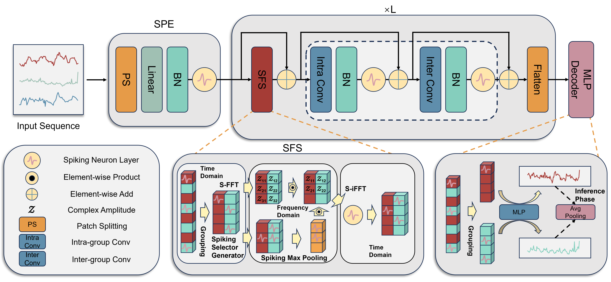

# SpikF: Spiking Fourier Network for Efficient Long-term Prediction

This repository contains the official implementation of the paper:  
**"SpikF: Spiking Fourier Network for Efficient Long-term Prediction"**  
(*ICML, 2025*)



## Highlights

* **Spiking Neural Networks for Long-Term Prediction**: We propose **SpikF**, the first attention-free spiking framework tailored for long-horizon forecasting tasks.
* **Frequency Domain Selection**: Introduces a novel frequency-domain selection mechanism that captures long-range temporal dependencies.
* **Overcoming Key Challenges**: Addresses the limitations of existing SNN encoders and spiking self-attention by avoiding positional encodings.
* **Superior Performance**: Achieves **1.9% lower MAE** on average compared to state-of-the-art models across **8 benchmark datasets**.
* **Energy Efficiency**: Delivers up to **3.16× reduction in energy consumption**, making it a sustainable solution for large-scale time-series applications.

---

## Dependencies & Installation
We provide a conda environment setup for easy reproduction:

```bash
git clone https://github.com/WWJ-creator/SpikF.git
cd SpikF
conda create -n SpikF python=3.10
conda activate SpikF
pip install -r requirements.txt
````

---

## Datasets

We use standard benchmark datasets for training and evaluation.
Datasets can be downloaded via the following links:

* **Google Drive**: [Download Link](https://drive.google.com/file/d/1l51QsKvQPcqILT3DwfjCgx8Dsg2rpjot/view?usp=drive_link)
* **Baidu Cloud**: [Download Link](https://pan.baidu.com/s/11AWXg1Z6UwjHzmto4hesAA?pwd=9qjr)

Put the downloaded datasets under `./datasets/long/` folder:

```
./datasets/long/
  ETTh1.csv
  ETTh2.csv
  ETTm1.csv
  ETTm2.csv
  ...
```

---

## Usage

### Training

To start training, simply run one of the provided scripts under the `scripts/` directory.  
For example, to train on the **ETTh1** dataset:

```bash
bash scripts/run_ETTh1.sh
```

---

## Citation

If you find this repository useful, please consider citing:

```bibtex
@inproceedings{wu2025spikf,
  title     = {SpikF: Spiking Fourier Network for Efficient Long-term Prediction},
  author    = {Wenjie Wu and Dexuan Huo and Hong Chen},
  booktitle = {Forty-second International Conference on Machine Learning},
  year      = {2025},
  url       = {https://openreview.net/forum?id=5jlvLwoO1n}
}

```

---

## Acknowledgements

This repo is built upon the excellent open-source implementations from:

* [Informer](https://github.com/zhouhaoyi/Informer2020)
* [Autoformer](https://github.com/thuml/Autoformer)
* [iTransformer](https://github.com/thuml/iTransformer)
* [Time-Series-Library](https://github.com/thuml/Time-Series-Library)

---

## Contact

For questions, feel free to open an issue or contact:
**\[Wenjie Wu]** – \[[wwj23@mails.tsinghua.edu.cn](wwj23@mails.tsinghua.edu.cn)]
